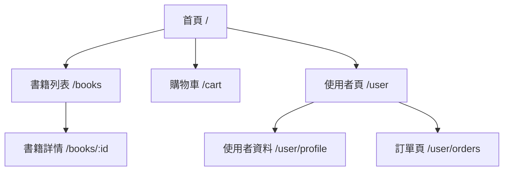

# EBOOK網站架構
### 前端路由設定--React.js

```mermaid
graph TD
    A[首頁 /] --> B[書籍列表 /books]
    B --> C[書籍詳情 /books/:id]
    A --> D[購物車 /cart]
    A --> E[使用者頁 /user]
    E --> F[使用者資料 /user/profile]
    E --> G[訂單頁 /user/orders]
```

