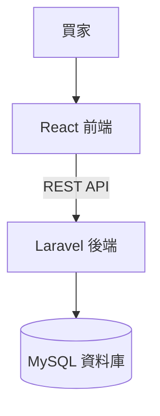

# 📖EBOOK網站

## 網站架構

```mermaid
graph TD
    Buyer[買家] --> ReactApp[React 前端]
    

    ReactApp -->|REST API | LaravelAPI[Laravel 後端]
    LaravelAPI --> MySQL[(MySQL 資料庫)]
```
## 前端架構README.md 
https://github.com/Yang-012/PhpfinalProject/edit/main/src/frontend
## 後端架構README.md 
https://github.com/Yang-012/PhpfinalProject/blob/main/src/severice1
