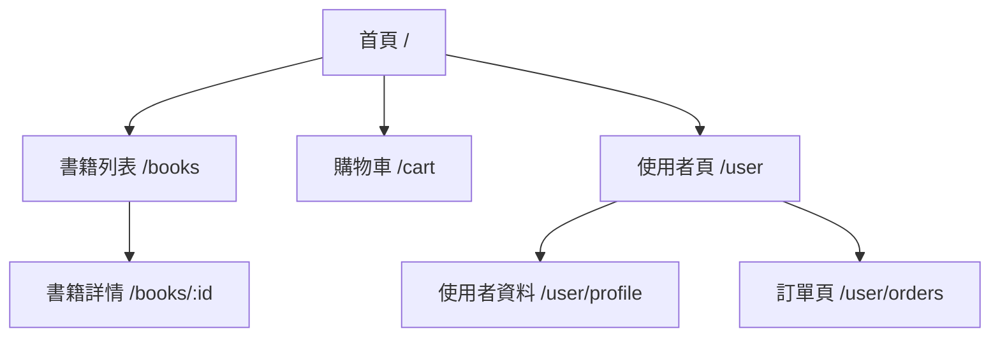

# 📖EBOOK網站架構
## 前端路由設定--React.js

## 資料庫ER圖--Mysql
```mermaid
erDiagram
    Orders_header {
        INT order_id PK
        INT user_id FK
        INT order_discount
        TIMESTAMP order_created_at
        VARCHAR order_status
        VARCHAR order_payment
        VARCHAR order_shipping
    }
Orders_Details {
        INT order_item_id PK
        INT order_id FK
        INT product_id FK
        INT order_item_quantity
        INT order_item_price
    }
Products {
        INT product_id PK
        STRING product_name
        STRING product_summary
        INT product_price
        INT product_quantity
        STRING product_img
        DATETIME product_updated_at
    }
Users {
        INT user_id PK
        STRING user_name
        STRING user_email UNIQUE
        STRING user_address
    }
ShippingCarts {
        INT cart_id PK
        STRING session_ID UNIQUE
        INT user_id UNIQUE
        DATETIME cart_updated_at
    }
    ShippingCarts_Products {
        INT cart_id FK
        INT product_id FK
        INT product_quantity
    }
    Users ||--o{ Orders_header : "has"
    Orders_header ||--|{ Orders_Details : "contains"
    Products ||--o{ Orders_Details : "ordered_in"
    Users ||--o{ ShippingCarts : "owns"
    ShippingCarts ||--o{ ShippingCarts_Products : "contains"
    Products ||--o{ ShippingCarts_Products : "in_cart"
```
## 後端API 總覽--PHP-Laravel

### 用戶 API
| HTTP 方法 | 路徑            | 描述             |
|-----------|-----------------|------------------|
| GET       | /api/users      | 獲取所有用戶     |
| GET       | /api/users/:id  | 獲取特定用戶資料 |
| POST      | /api/users      | 新增用戶         |
| PUT       | /api/users/:id  | 更新用戶資料     |
| DELETE    | /api/users/:id  | 刪除用戶         |
### 書籍 API

| HTTP 方法 | 路徑            | 描述             |
|-----------|-----------------|------------------|
| GET       | /api/books      | 獲取所有書籍     |
| GET       | /api/books/:id  | 獲取特定書籍詳情 |
| POST      | /api/books      | 新增書籍         |
| PUT       | /api/books/:id  | 更新書籍資訊     |
| DELETE    | /api/books/:id  | 刪除書籍         |

