# 📖EBOOK網站

## 網站架構

```mermaid
graph TD
    Buyer[買家] --> ReactApp[React 前端]
    Seller[賣家] --> ReactApp
    Admin[總管理者] --> ReactApp

    ReactApp -->|REST API | LaravelAPI[Laravel 後端]
    LaravelAPI --> MySQL[(MySQL 資料庫)]
```

前端架構README.md 
https://github.com/Yang-012/PhpfinalProject/edit/main/src/frontend/README.md
## 資料庫ER圖--Mysql

## 後端API 總覽--PHP-Laravel

### 用戶 API
| HTTP 方法 | 路徑            | 描述             |
|-----------|-----------------|------------------|
| GET       | /api/users      | 獲取所有用戶     |
| GET       | /api/users/:id  | 獲取特定用戶資料 |
| POST      | /api/users      | 新增用戶         |
| PUT       | /api/users/:id  | 更新用戶資料     |
| DELETE    | /api/users/:id  | 刪除用戶         |
### 書籍 API

| HTTP 方法 | 路徑            | 描述             |
|-----------|-----------------|------------------|
| GET       | /api/books      | 獲取所有書籍     |
| GET       | /api/books/:id  | 獲取特定書籍詳情 |
| POST      | /api/books      | 新增書籍         |
| PUT       | /api/books/:id  | 更新書籍資訊     |
| DELETE    | /api/books/:id  | 刪除書籍         |

