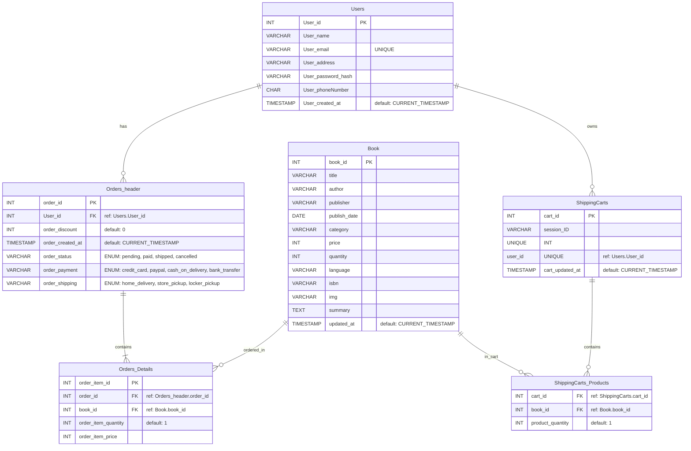

## 後端架構設計--PHP-Laravel--Mysql

## Mysql資料庫ER圖

## 後端API 總覽

### 用戶 API
| HTTP 方法 | 路徑            | 描述             |
|-----------|-----------------|------------------|
| GET       | /api/users      | 獲取所有用戶     |
| GET       | /api/users/:id  | 獲取特定用戶資料 |
| POST      | /api/users      | 新增用戶         |
| PUT       | /api/users/:id  | 更新用戶資料     |
| DELETE    | /api/users/:id  | 刪除用戶         |
### 書籍 API

| HTTP 方法 | 路徑            | 描述             |
|-----------|-----------------|------------------|
| GET       | /api/books      | 獲取所有書籍     |
| GET       | /api/books/:id  | 獲取特定書籍詳情 |
| POST      | /api/books      | 新增書籍         |
| PUT       | /api/books/:id  | 更新書籍資訊     |
| DELETE    | /api/books/:id  | 刪除書籍         |

