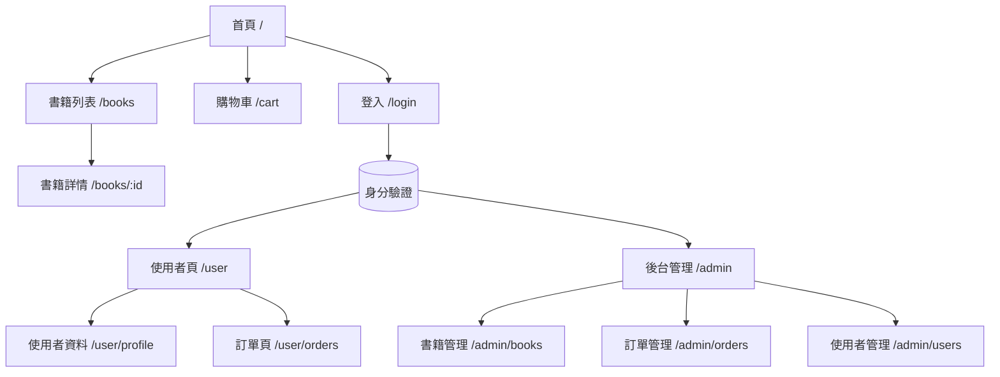

# EBOOK前端架構
## 前端路由設定--React.js

### 功能確認清單

1. **檢索功能**
   - [ ] 搜索欄可以讓用戶輸入書名、作者、ISBN 等進行搜索
   - [ ] 搜索結果應顯示相關的書籍，並提供快速連結到詳細頁面
   - [ ] 支援篩選選項（例如書籍類型、價格範圍等）
   - [ ] 支援排序功能（如按銷量、評分、價格等）

2. **登入功能**
   - [ ] 顯示「登入」按鈕在首頁右上角
   - [ ] 點擊登入按鈕後，彈出登入表單（或跳轉至登入頁面）
   - [ ] 成功登入後，顯示用戶名並提供下拉選單（包含帳戶設定、訂單紀錄、登出選項）
   - [ ] 支援第三方登入（例如 Google、Facebook）

